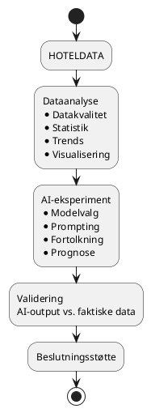
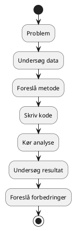
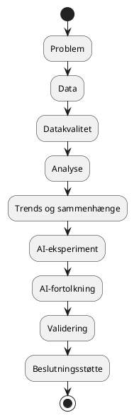

# Sammenfald mellem AI i softwareudvikling og dataanalyse

**Dato:** 01/9 2026
**Læringsmål dækket:** [AI i softwareprojekter](../Læringsmål–AI_til_softwareløsninger.md) og [Dataanalyse og databehandling](../Læringsmål–Dataanalyse_og_databehandling.md)

Mine to læringsmål omhandler AI i softwareudvikling og dataanalyse og databehandling. De har forskellige faglige fokusområder, men når jeg arbejder praktisk med dem i hotelprojektet, opstår der et tydeligt sammenfald.

Dataanalysen giver mig et fagligt grundlag for at forstå og kontrollere hoteldata, mens AI-læringsmålet giver mig mulighed for at undersøge, hvordan AI kan anvendes til at arbejde med og fortolke disse data. De to læringsmål kan derfor ses som to komplementære kompetenceområder: dataanalyse hjælper mig med at forstå dataene – AI hjælper mig med at undersøge, hvordan teknologien kan arbejde med dataene. Samtidig giver dataanalysen mig et grundlag for at kontrollere, om AI's output faktisk kan understøttes af data.

## 🔗 Sammenfald mellem de to læringsmål

### Dataanalyse som fundament for AI

Før AI kan anvendes meningsfuldt på hoteldata, skal jeg først forstå kvaliteten og strukturen af dataene. Mit dataanalyse-læringsmål fokuserer blandt andet på:

- dataindsamling
- datastrukturering
- datakvalitet
- datarensning
- statistik
- trends og mønstre
- sammenhænge mellem variable
- visualisering
- fortolkning af resultater

Jeg skal blandt andet kunne identificere datakvalitetsproblemer, anvende statistiske beregninger og finde trends og sammenhænge i hoteldata. Det bliver vigtigt for AI-delen, fordi AI's output kun kan vurderes ordentligt, hvis jeg selv forstår de data, som AI arbejder med.

Eksempelvis kan jeg først undersøge: *er belægningen højere i weekenden?* Ved hjælp af statistik og visualisering kan jeg finde ud af, om der faktisk er en sådan sammenhæng. Derefter kan jeg undersøge: *kan AI identificere den samme sammenhæng?* På den måde bliver dataanalysen også en form for kontrolgrundlag for AI.

### AI som værktøj i softwareudviklingen

Mit AI-læringsmål handler ikke kun om at få AI til at skrive kode. Fokus er at kunne identificere, vælge, anvende og evaluere AI-teknologier i konkrete problemstillinger. Jeg skal blandt andet undersøge forskellige modeller og sammenligne dem ud fra:

- kvalitet
- hastighed
- ressourceforbrug
- privacy/datahåndtering
- anvendelighed

Jeg skal også arbejde med prompts, AI-fortolkning af hoteldata og kritisk sammenligning mellem AI-output og de faktiske data. Derfor bliver spørgsmålet ikke kun *kan AI skrive koden?*, men også: *kan jeg bruge AI systematisk og vurdere kvaliteten af det, AI producerer?*

### Hotelprojektet som fælles case

Hotelprojektet giver mig mulighed for at kombinere de to læringsmål i én samlet proces. Jeg kan eksempelvis arbejde med historiske hoteldata indeholdende:

- Dato
- Ugedag
- Sæson
- Bookede værelser
- Kapacitet
- Belægningsprocent
- Værelsestype
- Pris

Disse variable indgår direkte i dataanalyse-læringsmålet. Processen kan eksempelvis være:

Det betyder, at det samme projekt kan skabe dokumentation til begge læringsmål.

### Fra AI-genereret kode til fagligt valideret resultat

Et konkret eksempel kan være, at jeg beder en AI-agent om at udvikle en analyse af hotelbelægningen. Agenten kan eksempelvis hjælpe med at:

1. Indlæse datasættet
2. Kontrollere manglende værdier
3. Beregne statistik
4. Gruppere data efter ugedag
5. Generere visualiseringer
6. Foreslå trends og mønstre

Her mødes de to læringsmål.

**AI-perspektivet** – jeg undersøger:

- Hvor godt AI løser opgaven
- Hvor meget jeg skal ændre AI's forslag
- Om forskellige modeller giver forskellige resultater
- Hvordan prompts påvirker resultatet
- Hvornår AI laver fejl
- Hvornår jeg selv skal overtage kontrollen

Dette passer med kravet om at eksperimentere med forskellige modeller og prompts samt dokumentere resultater, fejl og egne vurderinger.

**Dataanalyse-perspektivet** – jeg undersøger:

- Om data er korrekt behandlet
- Om beregningerne er korrekte
- Om visualiseringerne er relevante
- Om de identificerede trends faktisk findes
- Om konklusionerne kan understøttes af data
- Hvilke begrænsninger datasættet har

Det svarer til dataanalyse-læringsmålets fokus på at identificere mønstre, undersøge sammenhænge og vurdere, hvad data kan og ikke kan fortælle.

### Agentisk AI og de to læringsmål

Sammenfaldet bliver endnu tydeligere, når jeg anvender agentisk AI. En AI-agent kan eksempelvis arbejde gennem flere trin:

Det giver mig mulighed for at undersøge AI som en del af en mere komplet softwareudviklingsproces. Men agenten bliver ikke den faglige autoritet. Min rolle bliver i højere grad at:

**definere problemet → styre processen → kontrollere output → validere resultatet → træffe faglige valg**

Det passer godt med AI-læringsmålet, hvor jeg skal kunne evaluere AI-output og vurdere, hvornår menneskelig kontrol er nødvendig.

### Fra data til beslutningsstøtte

Det vigtigste sammenfald mellem læringsmålene er derfor ikke selve teknologien. Det er processen:

Eksempelvis kan dataanalysen vise en historisk sammenhæng mellem events og hotelbelægning. Derefter kan AI bruges til at undersøge, om den kan identificere samme mønster og eventuelt hjælpe med at fortolke, hvilke faktorer der kan have påvirket efterspørgslen. Det er netop en del af AI-læringsmålet at undersøge mønstre, sammenhænge, eventeffekter og mulige forklaringer i hoteldata.

## 🔄 Kolbs læringscirkel i praksis

**1. Konkret erfaring**

Jeg arbejder praktisk med hoteldata og AI. Jeg bruger Python-biblioteker til at håndtere manglende data og forkerte datatyper – dette kan kombineres med AI. Et eksempel er, at jeg lader en AI-agent analysere belægningsdata: agenten indlæser datasættet, kontrollerer manglende værdier, beregner statistik, grupperer data efter ugedag, genererer visualiseringer og foreslår trends og mønstre.

**2. Refleksion**

- Hvad fungerede?
  > De trin, hvor AI'en kunne følge en klar, veldefineret opgave – fx indlæsning af data og beregning af simple statistiske mål.
- Hvad fungerede ikke?
  > Fortolkningen blev usikker, når AI'en skulle vurdere årsager bag mønstre uden at kende hotellets kontekst (fx events, lokale forhold) – her kunne resultatet ikke stå alene.
- Var AI'ens resultat korrekt?
  > Kun delvist – nogle beregninger kunne verificeres direkte mod data, mens AI'ens fortolkninger af *hvorfor* et mønster opstod krævede min egen faglige kontrol, før jeg kunne stole på dem.

**3. Abstrakt begrebsliggørelse**

Jeg kobler erfaringerne til teori om eksempelvis:

- statistik
- datakvalitet
- visualisering
- LLM'er
- prompting
- Machine Learning
- modelvalg
- AI-evaluering
- usikkerhed
- human-in-the-loop

**4. Aktiv eksperimenteren**

Jeg ændrer eksempelvis datasættet, analysen, visualiseringen, prompten, AI-modellen eller metoden og gennemfører derefter et nyt eksperiment. Det giver en løbende proces:

**Eksperiment → refleksion → teori → forbedring → nyt eksperiment**

Den samme læringsstruktur findes i dataanalyse-læringsmålet, hvor processen beskrives som analyse → refleksion → teori → ny analyse.

## 🎯 Hvilke kernemål i læringsmål dækkes

🟢 dækkes helt, 🟡 dækkes delvist, 🔴 dækkes kun lidt eller slet ikke endnu.

### Dataanalyse og databehandling

| Kerneområde | Vægt i læringsmål | Dækning | Begrundelse |
|---|---|:---:|---|
| Dataindsamling | Stor | 🟡 | Hoteldatas relevante variable er identificeret (dato, ugedag, sæson, m.fl.), men datasættet er ikke indsamlet i denne post |
| Datastrukturering | Stor | 🟡 | Variablene til hoteldata er struktureret konceptuelt |
| Datakvalitet | Stor | 🟡 | Kontrol af manglende værdier indgår i den beskrevne AI-agent-proces, men er ikke udført konkret her |
| Datarensning | Stor | 🔴 | Ikke konkret udført i denne post |
| Dataanalyse | Stor | 🟡 | Statistik, trends og sammenhænge er planlagt og eksemplificeret (fx belægning i weekenden), men ikke gennemført på et faktisk datasæt |
| Statistik | Stor | 🟡 | Indgår i den beskrevne proces, men ikke udført konkret her |
| Deskriptiv statistik | Stor | 🟡 | Samme som ovenfor |
| Trends og mønstre | Stor | 🟡 | Eksemplificeret via weekend-belægning og events, men ikke udført konkret |
| Sammenhænge mellem variable | Stor | 🟡 | Pris/belægning og events/efterspørgsel bruges som eksempler |
| Datavisualisering | Stor | 🔴 | Nævnt som en del af processen, men ikke produceret i denne post |
| Fortolkning af resultater | Mindre | 🟡 | Central pointe: at vurdere, hvad data og AI's fortolkning af data kan og ikke kan understøtte |
| Formidling af data | Mindre | 🔴 | Denne post formidler en samlet proces, ikke konkrete dataresultater |

### AI i softwareprojekter

| Kerneområde | Vægt i læringsmål | Dækning | Begrundelse |
|---|---|:---:|---|
| Python for AI | Stor | 🔴 | Ikke relevant for denne post |
| Machine Learning | Stor | 🔴 | Ikke relevant for denne post |
| AI til fortolkning af data | Stor | 🟡 | Centralt tema, men endnu ikke afprøvet konkret på et hoteldatasæt |
| Large Language Models (LLM) | Stor | 🔴 | Omtales generelt sammen med AI-agenter, men ikke undersøgt specifikt |
| Modelvalg og model comparison | Stor | 🟡 | Kriterier for sammenligning (kvalitet, hastighed, ressourceforbrug, privacy, anvendelighed) er opstillet, men endnu ikke anvendt på konkrete modeller |
| Prompt engineering | Stor | 🟡 | Prompting indgår som en del af eksperimentet, men er ikke konkret afprøvet i denne post |
| Generativ AI | Stor | 🔴 | Ikke relevant for denne post |
| AI-baseret beslutningsstøtte | Stor | 🟢 | Hele postens konklusion er netop, hvordan data + AI + validering fører til beslutningsstøtte |
| OCR | Stor | 🔴 | Ikke relevant for denne post |
| Feature extraction | Stor | 🔴 | Ikke relevant for denne post |
| Fortolkning af hoteldata | Mindre | 🟡 | Eksemplificeret via belægning/events, men ikke udført konkret |
| Test og evaluering af AI-output | Mindre | 🟡 | Central pointe: AI-output skal valideres mod faktiske data, men er ikke konkret testet her |
| Fejlhåndtering og usikkerhed | Mindre | 🔴 | Ikke behandlet konkret i denne post |
| Human-in-the-loop | Mindre | 🟢 | Eksplicit tema: min rolle er at definere problemet, styre processen, kontrollere output og træffe de faglige valg |
| Privacy og ansvarlig AI | Mindre | 🔴 | Kun nævnt som ét ud af flere sammenligningskriterier, ikke uddybet |

## 🏨 Hvilken værdi kan det give et hotel management-system?

Kombinationen af de to læringsmål kan give flere konkrete muligheder i et hotel management-system.

**Dataanalyse kan bruges til at forstå:**

- belægningsmønstre
- sæsonvariation
- forskelle mellem ugedage
- værelsestyper
- pris og belægning
- usædvanlige perioder

**AI kan derefter undersøges som støtte til:**

- fortolkning af hoteldata
- efterspørgselsprognoser
- analyse af events
- prisforslag
- rapportgenerering
- beslutningsstøtte

Men værdien ligger ikke kun i selve AI-outputtet. Den ligger i at kunne skabe en proces, hvor:

**Data analyseres → AI anvendes → resultatet kontrolleres → mennesket træffer beslutningen.**

Mine to læringsmål er forskellige, men de understøtter hinanden meget direkte. Dataanalyse og databehandling giver mig kompetencer til at indsamle, rense, analysere, visualisere og fortolke hoteldata. AI i softwareudvikling giver mig kompetencer til at undersøge, vælge, anvende og evaluere AI-teknologier i konkrete problemstillinger.

Hotelprojektet bliver derfor en fælles case, hvor de to læringsmål kan arbejde sammen. Det giver mig mulighed for både at undersøge *"kan AI hjælpe mig med at løse opgaven?"* og *"er resultatet korrekt, kan det dokumenteres ud fra data, og er det fagligt anvendeligt?"*

Det sidste er centralt. En AI-genereret analyse bliver ikke automatisk korrekt, bare fordi koden kan køres, eller resultatet ser overbevisende ud. Mit mål er derfor ikke blot at lære at bruge AI, men at lære at bruge AI med faglig kontrol. På den måde bliver de to læringsmål to sider af samme kompetence: at kunne anvende AI og dataanalyse til at udvikle datadrevne softwareløsninger, samtidig med at jeg kan forstå, kontrollere og evaluere resultaterne.
