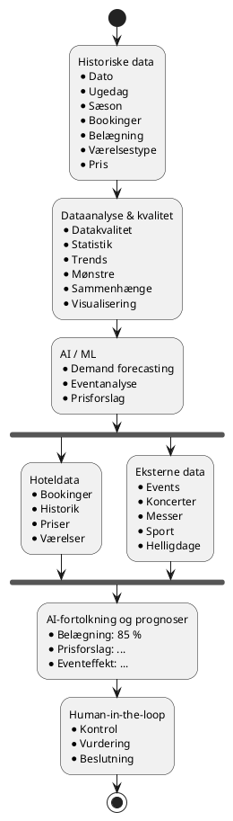
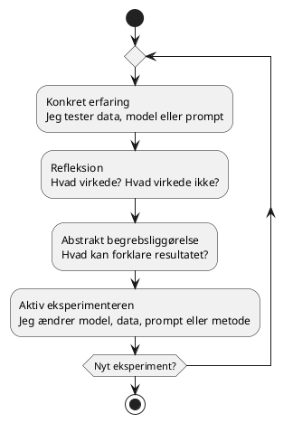

# De 3 AI-problemer i projektet

**Dato:** 20/9 2026
**Læringsmål dækket:** [AI i softwareprojekter](../Læringsmål–AI_til_softwareløsninger.md) og [Dataanalyse og databehandling](../Læringsmål–Dataanalyse_og_databehandling.md)

For at gøre projektet fagligt stærkt har jeg valgt at opdele arbejdet i tre konkrete AI-problemstillinger, som tager udgangspunkt i hotellets data og potentielle beslutningsbehov.

De tre problemstillinger giver samtidig mulighed for at arbejde systematisk med mine læringsmål inden for dataanalyse, AI, Machine Learning, modelvalg, evaluering og beslutningsstøtte.

Målet er ikke nødvendigvis at udvikle en færdig kommerciel AI-løsning. Fokus er at undersøge, hvordan AI kan anvendes, hvilke data der er nødvendige, hvordan resultaterne kan evalueres, og hvor menneskelig vurdering stadig er nødvendig.

## 🧭 De tre AI-problemstillinger

### 1. Prognose for belægningsgrad

**Problem:** Hvor mange værelser forventer vi bliver booket på en bestemt dato?

Her undersøger jeg, om historiske hoteldata kan bruges til at identificere mønstre og lave en prognose for fremtidig efterspørgsel.

Et eksempel på input kunne være:

```
Dato:               15. oktober
Ugedag:             Torsdag
Sæson:              Efterår
Historisk demand:   Høj
Event:              Koncert
Event størrelse:    8.000 personer
```

Modellen kunne eksempelvis give:

```
Forventet belægning: 87 %
```

87 % er her et eksempel på et modeloutput – ikke et på forhånd kendt korrekt resultat. Det interessante fagligt bliver derfor at undersøge:

- Hvilke variable påvirker resultatet?
- Kan modellen identificere de samme mønstre som den statistiske analyse?
- Hvor præcis er prognosen?
- Hvornår er modellen usikker?
- Hvordan kan resultatet kontrolleres mod de faktiske data?

Det kobler direkte til mit dataanalyse-læringsmål, hvor jeg skal identificere trends, mønstre og sammenhænge i hoteldata og vurdere, hvad data kan og ikke kan fortælle. Det kobler samtidig til AI-læringsmålet, hvor jeg skal anvende AI til at identificere mønstre i belægningen og sammenholde AI'ens fortolkning med de faktiske data.

### 2. Begivenhedens effekt på efterspørgslen

**Problem:** Hvor meget kan et event påvirke hotellets efterspørgsel?

Her undersøger jeg, hvordan eksterne faktorer kan indgå i analysen af hoteldata. Et forsimplet eksempel kunne være:

```
Normal forventet belægning       62 %

+ Stor koncert                   +15 %
+ Messe                           +9 %
+ Weekend                         +7 %
+ Skoleferie                      +4 %

Eksempel på beregnet belægning    89 %
```

Et event kan eksempelvis beskrives med:

```
event_exists = 1
event_type = concert
distance_km = 2.4
expected_attendance = 8000
event_duration = 2 days
```

Her bliver projektet interessant, fordi jeg kan undersøge, om eksterne data kan forklare variationer i hotellets efterspørgsel. Jeg vil blandt andet undersøge:

- Om der kan identificeres en sammenhæng mellem events og belægning
- Om forskellige eventtyper påvirker efterspørgslen forskelligt
- Om eventets størrelse har betydning
- Om afstand til hotellet har betydning
- Om AI kan identificere sammenhænge, som også kan findes i den statistiske analyse

Dette passer direkte til dataanalyse-læringsmålet, hvor jeg skal undersøge sammenhænge mellem variable og understøtte observationerne med beregninger eller visualiseringer. Det passer også til AI-læringsmålet, hvor AI blandt andet skal kunne undersøge effekten af events eller sæsoner og mulige forklaringer på ændringer i efterspørgslen.

### 3. Dynamisk prissætning som beslutningsstøtte

**Problem:** Hvis efterspørgslen forventes at være høj, hvordan kan AI understøtte hotellets vurdering af værelsesprisen?

I stedet for at lade AI'en bestemme prisen autonomt vil jeg bruge resultatet som beslutningsstøtte. Et forsimplet eksempel:

| Efterspørgsel | Belægning | Prisforslag |
|---|:---:|:---:|
| Lav | 35 % | 27 $ |
| Normal | 65 % | 33 $ |
| Høj | 90 % | 38 $ |

Det centrale spørgsmål er derfor ikke *"hvad er den rigtige pris?"*, men: *"kan AI bruge de tilgængelige data til at generere et begrundet prisforslag, som kan indgå i hotellets beslutning?"* Jeg vil derfor undersøge:

- Sammenhængen mellem pris og belægning
- Hvordan sæson, ugedag og events påvirker efterspørgslen
- Om AI's forslag stemmer overens med de historiske data
- Hvor følsomt resultatet er over for ændringer i input
- Hvornår et menneske bør kontrollere eller tilsidesætte AI'ens forslag

Det giver en naturlig human-in-the-loop-vinkel, som er en del af mit AI-læringsmål. Jeg skal netop kunne vurdere, hvornår AI-output kræver menneskelig kontrol og dokumentere fejl og usikkerhed.

### Data → Analyse → AI → Beslutningsstøtte

De tre problemstillinger hænger sammen. Først skal jeg forstå og kvalitetssikre hoteldataene. Derefter kan jeg analysere trends og sammenhænge, som senere kan bruges som grundlag for AI-eksperimenterne.



### Hvad skal jeg kunne dokumentere?

For at gøre projektet fagligt stærkt vil jeg ikke kun vise det endelige resultat. Jeg vil dokumentere processen. Det betyder blandt andet:

- hvilke data jeg anvender
- datakvalitetsproblemer
- statistiske beregninger
- visualiseringer
- identificerede trends og mønstre
- hvilke AI-modeller jeg tester
- hvorfor en model vælges
- forskellige prompts og resultater
- AI'ens fejl og usikkerheder
- sammenligning mellem AI-output og faktiske data
- hvor menneskelig kontrol er nødvendig
- mine refleksioner gennem Kolbs læringscirkel

Det passer med portfolio-kravene i begge læringsmål, hvor både analyse, eksperimenter, evaluering, fejl, refleksion og dokumentation indgår.

## 🔄 Kolbs læringscirkel i praksis

De tre problemstillinger skal ikke bare implementeres. De skal bruges som eksperimenter i min læringsproces.



**1. Konkret erfaring**

For hver af de tre problemstillinger tester jeg data, en model eller en prompt og registrerer resultatet.

**2. Refleksion**

Efter hvert eksperiment besvarer jeg blandt andet:

- Hvad virkede?
  > Vurderes ved at sammenholde AI-output med de faktiske hoteldata og den statistiske analyse.
- Hvad virkede ikke?
  > Dokumenteres som konkrete fejl og usikkerheder i modellens prognoser, eventeffekter eller prisforslag.
- Hvornår var modellen usikker, og hvornår krævede resultatet menneskelig kontrol?
  > Registreres pr. testcase, så det kan indgå i vurderingen af, hvornår et menneske skal tilsidesætte AI'ens forslag.

**3. Abstrakt begrebsliggørelse**

Jeg kobler erfaringerne til teori om blandt andet:

- prognoser og efterspørgselsmodellering
- Machine Learning og modelevaluering
- variable og features (fx eventtype, afstand og forventet deltagerantal)
- sammenhæng mellem pris og efterspørgsel
- usikkerhed og følsomhed over for ændringer i input
- human-in-the-loop

**4. Aktiv eksperimenteren**

Jeg ændrer model, data, prompt eller metode og gennemfører et nyt eksperiment. Det giver en løbende proces:

**Eksperiment → refleksion → teori → forbedring → nyt eksperiment**

Det følger direkte strukturen i mit AI-læringsmål. Det samme princip bruges i dataanalysen, hvor jeg arbejder efter: analyse → refleksion → teori → ny analyse.

## 🎯 Hvilke kernemål i læringsmål dækkes

🟢 dækkes helt, 🟡 dækkes delvist, 🔴 dækkes kun lidt eller slet ikke endnu. Posten definerer problemstillingerne og afgrænser eksperimenterne – ingen af dem er gennemført endnu, så intet er sat til 🟢.

### Dataanalyse og databehandling

| Kerneområde | Vægt i læringsmål | Dækning | Begrundelse |
|---|---|:---:|---|
| Dataindsamling | Stor | 🟡 | Eksterne data (events, koncerter, messer, sport, helligdage) er identificeret som datakilder, men ikke indsamlet endnu |
| Datastrukturering | Stor | 🟡 | Events er beskrevet som strukturerede variable (event_type, distance_km, expected_attendance m.fl.) |
| Datakvalitet | Stor | 🟡 | Kvalitetssikring af hoteldata er defineret som første skridt, men ikke udført |
| Datarensning | Stor | 🔴 | Ikke relevant før der er et datasæt at rense |
| Dataanalyse | Stor | 🟡 | Den statistiske analyse er udset som sammenligningsgrundlag for AI'en, men ikke gennemført |
| Statistik | Stor | 🟡 | Statistiske beregninger indgår som kontrol af modellens mønstre, men er ikke udført |
| Deskriptiv statistik | Stor | 🔴 | Ikke behandlet i denne post |
| Trends og mønstre | Stor | 🟡 | Mønstre i belægning og eventeffekter er de centrale undersøgelsesspørgsmål |
| Sammenhænge mellem variable | Stor | 🟡 | Pris/belægning og event/efterspørgsel er defineret som konkrete sammenhænge, der skal undersøges |
| Datavisualisering | Stor | 🟡 | Nævnt som støtte til observationerne, men ingen visualiseringer er lavet endnu |
| Fortolkning af resultater | Mindre | 🟡 | At vurdere, hvad data og AI-output kan og ikke kan fortælle, er en central del af alle tre problemer |
| Formidling af data | Mindre | 🔴 | Ikke behandlet i denne post |

### AI i softwareprojekter

| Kerneområde | Vægt i læringsmål | Dækning | Begrundelse |
|---|---|:---:|---|
| Python for AI | Stor | 🔴 | Ikke relevant for denne post |
| Machine Learning | Stor | 🟡 | Belægningsprognosen er defineret som ML-problem, men ingen model er trænet endnu |
| AI til fortolkning af data | Stor | 🟡 | AI-fortolkning af belægning og eventeffekter er defineret, men ikke afprøvet |
| Large Language Models (LLM) | Stor | 🔴 | Modelvalg er ikke truffet i denne post |
| Modelvalg og model comparison | Stor | 🟡 | Test og begrundet valg af modeller indgår i dokumentationsplanen, men er ikke udført |
| Prompt engineering | Stor | 🟡 | Forskellige prompts og resultater indgår i dokumentationsplanen, men er ikke afprøvet |
| Generativ AI | Stor | 🔴 | Ikke relevant for denne post |
| AI-baseret beslutningsstøtte | Stor | 🟡 | Dynamisk prissætning er defineret som beslutningsstøtte frem for autonom prisfastsættelse, men ikke bygget |
| OCR | Stor | 🔴 | Ikke relevant for denne post |
| Feature extraction | Stor | 🟡 | Eventvariable (type, afstand, størrelse, varighed) er udset som features, men ikke udtrukket eller afprøvet |
| Fortolkning af hoteldata | Mindre | 🟡 | Kernen i alle tre problemer, men endnu ikke udført |
| Test og evaluering af AI-output | Mindre | 🟡 | Sammenligning mellem AI-output og faktiske data er defineret som evalueringsmetode |
| Fejlhåndtering og usikkerhed | Mindre | 🟡 | "Hvornår er modellen usikker?" er et eksplicit undersøgelsesspørgsmål |
| Human-in-the-loop | Mindre | 🟡 | Indgår eksplicit i problem 3 og i flowet, men er endnu kun defineret |
| Privacy og ansvarlig AI | Mindre | 🔴 | Ikke behandlet i denne post |

## 🏨 Hvilken værdi kan det give et hotel management-system?

De tre AI-problemer er valgt, fordi de svarer til reelle beslutningsbehov i drift af et hotel:

- **Prognose for belægningsgrad:** Et begrundet estimat af efterspørgslen giver et bedre grundlag for beslutninger om kapacitet, bemanding og planlægning.
- **Begivenhedens effekt:** Hvis eksterne events kan forklare udsving i efterspørgslen, kan hotellet forberede sig på travle perioder og vurdere, om marketing eller kapacitet skal justeres.
- **Dynamisk prissætning:** Et begrundet prisforslag kan indgå i hotellets vurdering af værelsesprisen, uden at AI'en træffer beslutningen alene.

Værdien ligger i den røde tråd gennem projektet:

**Historiske hoteldata → Dataanalyse → AI-eksperimenter → Prognoser og forslag → Human-in-the-loop → Beslutningsstøtte**

På den måde bliver AI ikke bare en funktion, der bliver lagt oven på hotelprojektet. Det bliver en praktisk måde at undersøge, hvordan data, AI og menneskelig faglig vurdering kan arbejde sammen i et hotel management-system.
