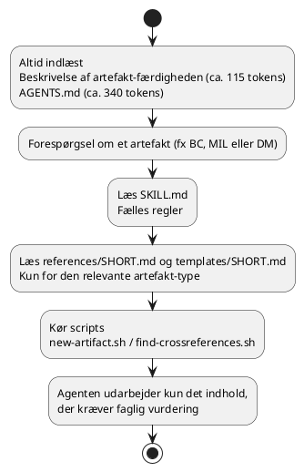

# Hvorfor én samlet "artefakt-færdighed" til en gruppe af færdigheder?

**Dato:** 21/9 2026
**Læringsmål dækket:** [AI i softwareprojekter](../Læringsmål–AI_til_softwareløsninger.md) og [Dataanalyse og databehandling](../Læringsmål–Dataanalyse_og_databehandling.md)

Jeg ønskede at oprette AI skills til håndtering af dokumentskabeloner til mine artefakter. Jeg oprettede en skill til hvert artefakt, men bemærkede, at både forbruget af kontekstplads og antallet af tokens steg hurtigt. Denne post dokumenterer, hvorfor jeg i stedet samlede dem i én artefakt-færdighed, og hvad det gav.

## 🧭 Fra 19 færdigheder til én

### Udfordringen: Kontekstpladsen er begrænset, og hvert token tæller

En AI-agent har en fast mængde tilgængelig kontekstplads. Alt, hvad agenten skal læse, før arbejdet påbegyndes, optager en del af denne plads; dermed er der mindre plads tilbage til de faktiske dokumenter og selve samtalen. Færdigheder indlæses i to trin:

- **Altid:** navnet og beskrivelsen af hver installeret færdighed.
- **Efter behov:** det fulde indhold af `SKILL.md` – kun når skills faktisk tages i brug.

Den oprindelige version af dette framework omfattede én færdighed pr. artefakt-type (i alt 19 færdigheder). Baseret på et groft estimat (antal tegn divideret med fire):

| | Tokens (ca.) |
|---|---:|
| 19 beskrivelser af færdigheder (indlæses altid) | 1.550 |
| `AGENTS.md` (indlæses altid) | 830 |
| Redigering af en enkelt business case (basisfærdighed, type-færdighed, skabelon) | 4.000 |
| Samlet indhold for alle færdigheder | 18.800 |

> **Kilde til beregning af tokens:** [Understanding and counting tokens (OpenAI)](https://help.openai.com/en/articles/4936856-understanding-and-counting-tokens)

Omkostningen lå i selve indholdet. Hver type-specifik færdighed gentog de samme afsnit om identitet, find krydsreference, validering og arbejdsgang, og kun få linjer i hvert afsnit var specifikke for den pågældende type.

### Tilgangen

**1. Én færdighed med type-specifikke filer, der kun læses ved behov**

Artefakt-færdigheden har én beskrivelse, der dækker alle artefakt-typer. Dens `SKILL.md` indeholder de regler, der er fælles for alle typer: tabellerne for metadata og versionshistorik, link-konventionen, reglen for krydsreferencer samt procedurerne for oprettelse, redigering og gennemgang. Alt, der er specifikt for en bestemt type, ligger i en lille fil, der kun læses, når der er brug for det:

```
framework/.agents/skills/artifact/
  SKILL.md              fælles regler (læses, hver gang færdigheden bruges)
  references/<SHORT>.md påkrævede afsnit og tips til krydsreferencer for én type
  templates/<SHORT>.md  dokumentskelettet for én type
```

Agenten finder den rette fil ud fra typens korte navn (BC, MIL, DM osv.), så der er ikke brug for router-logik eller opslagstabeller. De korte navne er angivet i artefakt-kataloget.

**2. Scripts udfører det rutineprægede arbejde**

Visse trin er deterministiske: valg af næste ID, identifikation af eksisterende relaterede artefakter, skrivning af linkblokken med korrekte relative stier samt opdatering af registreringsdatabasen. Et script udfører disse trin samlet og udskriver blot et par linjer; det kræver derfor minimal mental omstilling (kontekstskift) og eliminerer risikoen for inkonsistens:

- `new-artifact.sh` opretter et dokument ud fra en skabelon, hvor ID, krydsreferencer og links allerede er udfyldt.
- `find-crossreferences.sh` genkontrollerer krydsreferencen for et eksisterende dokument.
- `install-skills.sh` kopierer færdighedsfilen til den placering, hvor agenterne forventer at finde den.

Agenten skal herefter kun udarbejde det indhold, der kræver en faglig vurdering.

> **Note – deterministisk:** Alt, hvad der sker, er fuldstændigt bestemt af det, der skete før, og faste naturlove.

**3. Framework og projekt holdes adskilt**

De genanvendelige komponenter (QC-tjeklister, færdighedsfilen, kataloget, scripts) ligger i mappen `framework/` og indeholder ingen projektdata. Projektets egne dokumenter ligger i `docs/`. Dette gør det muligt for andre projekter at hente frameworket uden samtidig at få adgang til det aktuelle projekts business case eller review-dokumentation. Kataloget (typer, korte navne, relaterede typer) tilhører frameworket, mens projektets registreringsdatabase blot holder styr på dokumenternes placering og den næste versionsbetegnelse.

Sådan indlæses konteksten nu:



### Resultat

| | Før | Efter |
|---|---:|---:|
| Færdigheds-beskrivelser (indlæses altid) | ca. 1.550 tokens (19 færdigheder) | ca. 115 tokens (1 færdighed) |
| `AGENTS.md` (indlæses altid) | ca. 830 | ca. 340 |
| Redigering af business case | ca. 4.000 | ca. 1.400 |
| Redigering af milepæl, domænemodel eller ADR | ca. 3.000–4.000 | ca. 1.200–1.300 |

### Afvejninger

- Én enkelt beskrivelse skal kunne håndtere mange forskellige typer forespørgsler. Den angiver artefakt-typerne ved navn; hvis en agent ikke aktiverer denne færdighed for en given forespørgsel, skal de manglende nøgleord tilføjes beskrivelsen i `SKILL.md`.
- Scripts er skrevet i Bash. De kræver Bash, Perl og GNU coreutils (`realpath`); disse leveres med Git for Windows.
- Skabelonerne benytter pladsholdere (`@ID@`, `@CROSSREF@`, `@LINKS@`), som udfyldes af scriptet. Skabelonerne redigeres i `framework/.agents/skills/artifact/templates/`, og pladsholderne skal bevares.
- `.agents/skills/` er en kopi. Agenter læser færdigheder derfra; kilden under `framework/` redigeres, og `install-skills.sh` køres igen.

## 🔄 Kolbs læringscirkel i praksis

**1. Konkret erfaring**

Jeg oprettede en færdighed til hvert artefakt, så agenten kunne hjælpe med dokumentskabeloner. Undervejs bemærkede jeg, at forbruget af kontekstplads og antallet af tokens steg hurtigt.

**2. Refleksion**

- Hvad virkede ikke?
  > 19 færdigheder betød ca. 1.550 tokens i beskrivelser, der altid blev indlæst, og en redigering af en enkelt business case kostede ca. 4.000 tokens – mange tokens brugt, før agenten nåede til selve dokumentet.
- Hvor opstod problemet?
  > I selve indholdet: hver type-specifik færdighed gentog de samme afsnit om identitet, krydsreference, validering og arbejdsgang, og kun få linjer var specifikke for typen.
- Hvilke antagelser havde jeg?
  > At én færdighed pr. artefakt var den mest naturlige opdeling, uden at jeg havde regnet på, hvad den ville koste i kontekstplads.
- Hvilke værktøjer kunne hjælpe mig?
  > Et groft token-estimat (antal tegn divideret med fire) til at gøre omkostningen synlig før og efter, og scripts til de deterministiske trin (`new-artifact.sh`, `find-crossreferences.sh`, `install-skills.sh`).
- Hvad gjorde jeg anderledes?
  > Jeg samlede de fælles regler i én færdighed, flyttede det type-specifikke ind i små filer, der kun læses ved behov, lod scripts tage rutinearbejdet og holdt frameworket adskilt fra projektets egne dokumenter. Det bragte en redigering af en business case ned fra ca. 4.000 til ca. 1.400 tokens.

**3. Abstrakt begrebsliggørelse**

Jeg kobler erfaringen til teori om blandt andet:

- kontekstvindue og tokens i LLM'er
- indlæsning i trin (kun det nødvendige, når det er nødvendigt)
- undgå gentagelse (DRY) og adskillelse af ansvar
- deterministiske scripts versus AI-vurdering
- kriteriebaseret afvejning af fordele og ulemper (trade-offs)

**4. Aktiv eksperimenteren**

Jeg måler igen, når frameworket ændres, og holder øje med, om agenten faktisk aktiverer den samlede færdighed – hvis ikke, tilføjer jeg de manglende nøgleord til beskrivelsen. Ressourceforbrug er også et af de kriterier, jeg senere skal bruge, når jeg sammenligner LLM'er/AI-modeller i AI-læringsmålet, så metoden – estimér, mål, forbedr, mål igen – kan genbruges dér.

## 🎯 Hvilke kernemål i læringsmål dækkes

🟢 dækkes helt, 🟡 dækkes delvist, 🔴 dækkes kun lidt eller slet ikke endnu.

### Dataanalyse og databehandling

| Kerneområde | Vægt i læringsmål | Dækning | Begrundelse |
|---|---|:---:|---|
| Dataindsamling | Stor | 🔴 | Ikke relevant for denne post |
| Datastrukturering | Stor | 🔴 | Ikke relevant for denne post |
| Datakvalitet | Stor | 🔴 | Ikke relevant for denne post |
| Datarensning | Stor | 🔴 | Ikke relevant for denne post |
| Dataanalyse | Stor | 🔴 | Ikke relevant for denne post |
| Statistik | Stor | 🔴 | Ikke relevant for denne post |
| Deskriptiv statistik | Stor | 🔴 | Ikke relevant for denne post |
| Trends og mønstre | Stor | 🔴 | Ikke relevant for denne post |
| Sammenhænge mellem variable | Stor | 🔴 | Ikke relevant for denne post |
| Datavisualisering | Stor | 🔴 | Ikke relevant for denne post |
| Fortolkning af resultater | Mindre | 🔴 | Ikke relevant for denne post |
| Formidling af data | Mindre | 🔴 | Ikke relevant for denne post |

### AI i softwareprojekter

| Kerneområde | Vægt i læringsmål | Dækning | Begrundelse |
|---|---|:---:|---|
| Python for AI | Stor | 🔴 | Ikke relevant for denne post |
| Machine Learning | Stor | 🔴 | Ikke relevant for denne post |
| AI til fortolkning af data | Stor | 🔴 | Ikke relevant for denne post |
| Large Language Models (LLM) | Stor | 🟡 | Kontekstvindue og tokenforbrug er centrale LLM-begreber, som jeg har arbejdet praktisk med og målt på |
| Modelvalg og model comparison | Stor | 🔴 | Der er ikke sammenlignet modeller i denne post |
| Prompt engineering | Stor | 🟡 | Design af færdighedsbeskrivelser og -instruktioner, så agenten aktiverer og bruger dem korrekt, er en form for prompt-/kontekstdesign |
| Generativ AI | Stor | 🔴 | Ikke relevant for denne post |
| AI-baseret beslutningsstøtte | Stor | 🔴 | Ikke relevant for denne post |
| OCR | Stor | 🔴 | Ikke relevant for denne post |
| Feature extraction | Stor | 🔴 | Ikke relevant for denne post |
| Fortolkning af hoteldata | Mindre | 🔴 | Ikke relevant for denne post |
| Test og evaluering af AI-output | Mindre | 🔴 | Der er målt tokenforbrug, ikke kvaliteten af AI-output |
| Fejlhåndtering og usikkerhed | Mindre | 🟡 | Risikoen for, at agenten ikke aktiverer færdigheden, er identificeret og håndteres via nøgleord i beskrivelsen |
| Human-in-the-loop | Mindre | 🔴 | Ikke relevant for denne post |
| Privacy og ansvarlig AI | Mindre | 🟡 | Framework og projektdata holdes adskilt, så andre projekter ikke får adgang til projektets dokumenter |

## 🏨 Hvilken værdi kan det give et hotel management-system?

Værdien er indirekte: færdigheden understøtter dokumentationen af hotelprojektet, ikke selve hotelsystemet.

- **Mere kontekstplads til de faktiske dokumenter:** Når en redigering af en business case koster ca. 1.400 i stedet for ca. 4.000 tokens, er der mere plads tilbage til selve hotelprojektets dokumenter og samtalen.
- **Ensartet dokumentation:** Scripts, der udfylder ID, krydsreferencer og links, gør det lettere at holde business case, milepæle, domænemodel og ADR'er konsistente og sporbare – også når projektet vokser.
- **Genbrug uden at dele projektdata:** Fordi frameworket er adskilt fra projektets egne dokumenter, kan det genbruges i andre projekter uden at afsløre NF Hotels business case eller review-dokumentation.

Samlet set er det en konkret øvelse i at bruge AI ressourcebevidst og systematisk – den samme tilgang, som skal bruges, når AI senere anvendes på hoteldata.
