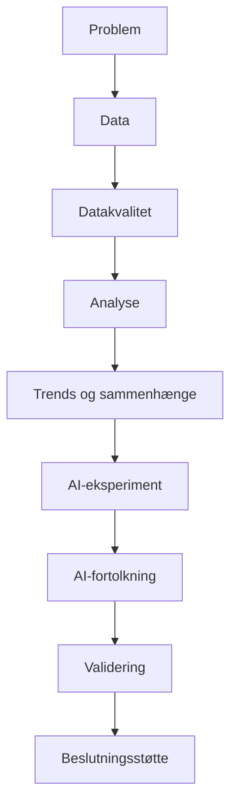

# UCL Datamatiker – Læringsmål og portfolio

Dette repository dokumenterer mit 30 ECTS-projekt på datamatiker-uddannelsen (UCL), i perioden **26. august – 6. december 2026** (15 uger). Projektet tager udgangspunkt i et hotel management-system (**NF Hotel**) og kombinerer to læringsmål:

- 🤖 **AI til softwareløsninger** – anvendelse af LLM'er, prompt engineering og Machine Learning/OCR til at fortolke hoteldata og understøtte hotellets beslutninger.
- 📊 **Dataanalyse og databehandling** – indsamling, rensning, statistisk analyse og visualisering af historiske hoteldata.

De to læringsmål er bevidst designet til at supplere hinanden: dataanalysen giver et fagligt grundlag for at forstå og kontrollere data, mens AI-sporet undersøger, hvordan teknologi kan fortolke og arbejde videre med de samme data.

## 📁 Indhold i repositoriet

| Sti | Indhold |
|---|---|
| [`Læringsmål–AI_til_softwareløsninger.md`](Læringsmål–AI_til_softwareløsninger.md) | Fuldt læringsmål for AI-sporet: mål, Bloom-niveauer, kerneområder, succeskriterier, milestones, Kolbs læringscirkel og SMART-tjek |
| [`Læringsmål–Dataanalyse_og_databehandling.md`](Læringsmål–Dataanalyse_og_databehandling.md) | Fuldt læringsmål for dataanalyse-sporet: samme struktur som ovenfor |
| [`Projektplan-Ugeplan.md`](Projektplan-Ugeplan.md) | Fælles projektplan med kerneområder, ugentlig timefordeling og en uge-for-uge milestone-plan for begge læringsmål |
| [`Portfolio/`](Portfolio) | Løbende portfolio-poster (logbog), der dokumenterer konkrete erfaringer, valg og refleksioner undervejs i projektet |
| [`plantuml/`](plantuml) | PlantUML-diagrammer, der visualiserer f.eks. flowet fra data til beslutningsstøtte |
| [`images/`](images) | Billeder brugt i læringsmål- og portfolio-dokumenterne |

## 🎯 Læringsmål

### 1. AI til softwareløsninger

Fokus på at forstå, vælge, anvende og evaluere AI-teknologier – ikke på at bygge en komplet kommerciel AI-løsning. Konkret arbejdes der med:

- Python for AI (via kursus)
- Sammenligning og valg af LLM'er/AI-modeller
- Prompt engineering til fortolkning af hoteldata
- Machine Learning/OCR til automatisk udlæsning af pasoplysninger (pasnummer, navn, nationalitet)
- Test, evaluering og human-in-the-loop-vurdering af AI-output

Se [Læringsmål–AI_til_softwareløsninger.md](Læringsmål–AI_til_softwareløsninger.md) for detaljerede succeskriterier og milestones.

### 2. Dataanalyse og databehandling

Fokus på dataenes kvalitet, behandling og fortolkning – ikke på at udvikle Machine Learning-modeller (det hører til læringsmål 1). Konkret arbejdes der med:

- Dokumentation af datakilde, struktur og begrænsninger
- Systematisk kontrol af datakvalitet (manglende værdier, dubletter, fejlformater m.m.)
- Statistiske mål (gennemsnit, median, kvartiler, standardafvigelse)
- Identifikation af trends, mønstre og sammenhænge
- Datavisualisering og formidling som beslutningsstøtte

Se [Læringsmål–Dataanalyse_og_databehandling.md](Læringsmål–Dataanalyse_og_databehandling.md) for detaljerede succeskriterier og milestones.

## 🗓️ Projektplan

[`Projektplan-Ugeplan.md`](Projektplan-Ugeplan.md) samler de to læringsmål i én fælles 15-ugers plan med:

- Kerneområder på tværs af projektet (AI & Machine Learning, Dataanalyse & databehandling, Programmering, Formidling & dokumentation)
- Ugentlig timefordeling (40 timer/uge: programmering, vejledning, teammøder samt læring/portfolio)
- En uge-for-uge oversigt over fælles kursusaktivitet og de to spors respektive milestones

## 🔄 Metode: Kolbs læringscirkel

Begge læringsmål og portfolio-posterne følger Kolbs læringscirkel:

**Konkret erfaring → Refleksion → Abstrakt begrebsliggørelse → Aktiv eksperimenteren → (nyt) Konkret erfaring**

Det betyder, at hver portfolio-post typisk beskriver noget, jeg konkret har lavet, hvad jeg lærte af det, hvordan det kobler sig til teori, og hvordan jeg bruger den viden i næste eksperiment.

## 🗂️ Portfolio

[`Portfolio/`](Portfolio) indeholder løbende, dato-mærkede poster, hvor jeg dokumenterer konkrete erfaringer og begrundede valg hen over projektperioden, f.eks.:

- Opsætning og fejlfinding af mit lab-miljø (Docker, database, Git-server m.m.)
- Begrundede teknologivalg (fx database, IDE)
- Refleksioner over sammenfaldet mellem AI- og dataanalyse-sporet

Hver post angiver, hvilke(t) læringsmål den dækker, og indeholder ofte en tabel, der viser dækningsgraden af de enkelte kerneområder (🟢 dækkes helt, 🟡 dækkes delvist, 🔴 dækkes kun lidt eller slet ikke endnu).

## ✅ SMART og evaluering

Hvert læringsmål afsluttes med et SMART-tjek (Specifikt, Målbart, Attraktivt/Opnåeligt, Relevant, Tidsbestemt), som bruges til at vurdere ved eksamen, om målet er nået – se de respektive læringsmåls-dokumenter for detaljerne.
